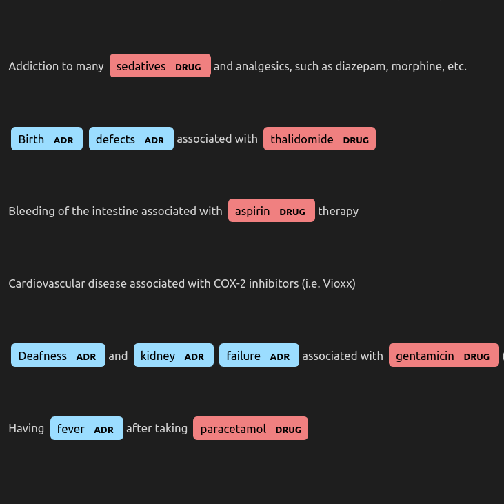

A lot of healthcare data is distributed and diffciult to access. We wanted to identify ADRs in discharge summaries. The model uses the HuggingFace Transformers library, beginning with the pretrained Spanbert model. Further MLM pre-training is performed on a large corpus of unannotated discharge summaries. Finally, fine-tuning is peformed on a corpus of annotated discharge summaries (annotated using Prodigy). The model performs NER, but final performance is measured at the document level using the maximum token-level score.

